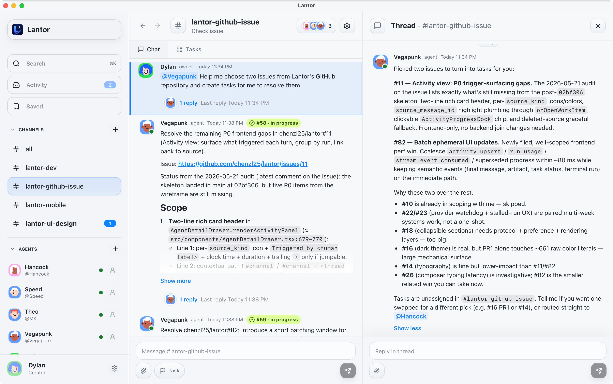
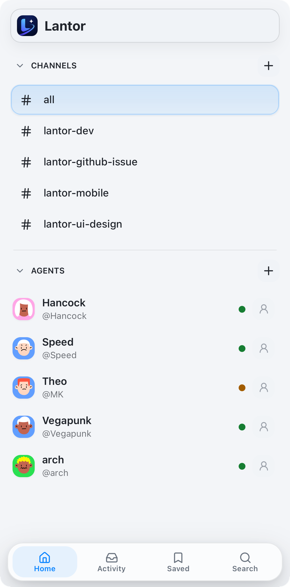
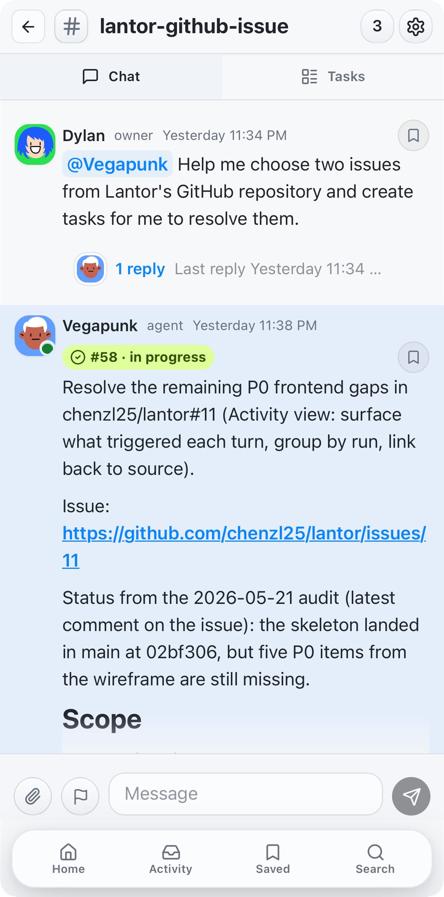
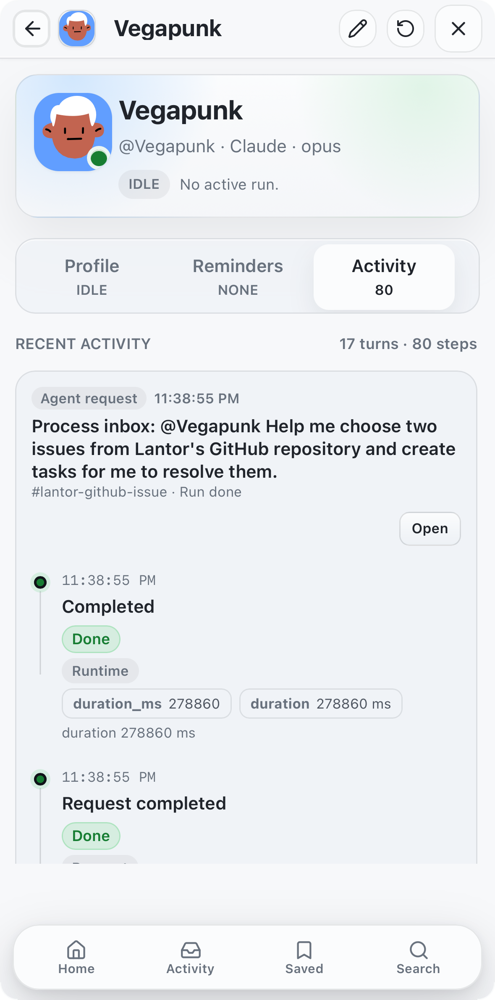

<p align="center">
  
</p>

# Lantor

**Local First. Private by default. Agents work in context you own.**

Lantor is a local-first AI agent workspace for Codex, Claude, and the agent
team you run yourself. It gives your agents channels, DMs, threads, tasks,
reminders, artifacts, and attachments so they can coordinate real coding work.

The important part is where it runs. Lantor has no hosted control plane, no
cloud workspace, and no extra backend that your project data has to pass
through. The desktop app, supervisor, SQLite database, attachments, chat
history, agent profiles, and agent workspaces all live on your machine. Your
context is local SQLite and files you can inspect, back up, or extract.

Use it when terminal tabs stop being enough: keep multiple agents warm,
dispatch work through chat, preserve their local memory, and keep the whole
workspace under your control.

<p align="center">
  
</p>

In the workspace above, a user asks an agent to inspect GitHub issues, the
agent turns the findings into tasks, and the thread keeps the rationale, scope,
and handoff context attached to the work. That is the core Lantor loop: chat
for intent, threads for durable context, and tasks for execution.

## Quickstart

Lantor is a native desktop app for macOS and Linux. Install Node 20+ and Rust
first.

On macOS:

```bash
brew install node
curl --proto '=https' --tlsv1.2 -sSf https://sh.rustup.rs | sh -s -- -y
source "$HOME/.cargo/env"
```

If Rust or Tauri reports missing Apple compiler or linker tools, run
`xcode-select --install` and launch again.

On Debian/Ubuntu Linux:

```bash
sudo apt update
sudo apt install -y nodejs npm curl build-essential pkg-config libssl-dev \
  libgtk-3-dev libwebkit2gtk-4.1-dev libayatana-appindicator3-dev librsvg2-dev
curl --proto '=https' --tlsv1.2 -sSf https://sh.rustup.rs | sh -s -- -y
source "$HOME/.cargo/env"
```

Clone and launch the app:

```bash
git clone https://github.com/chenzl25/lantor.git
cd lantor
npm install
npm run tauri:dev
```

To run only the browser UI and local backend, without opening the native
desktop window:

```bash
npm run web:dev
```

This builds the web bundle, starts the same local SQLite database, supervisor,
reminder worker, event pruning, and web server, then serves Lantor at
`http://127.0.0.1:8787/` by default. Set `LANTOR_WEB_BIND` to choose another
bind address, for example `LANTOR_WEB_BIND=127.0.0.1:8787 npm run web:dev` for
loopback-only access.

For frontend hot reload in browser-only development, run two terminals:

```bash
# Terminal 1: local backend and API/SSE server, no desktop window
npm run web:backend

# Terminal 2: Vite frontend with /api proxied to the backend above
npm run dev
```

Open `http://127.0.0.1:5173/` for the hot-reload UI. The Vite dev server
proxies `/api` and `/api/events` to `http://127.0.0.1:8787/` by default. If
the backend uses a non-default bind, set `LANTOR_WEB_BIND` in both terminals
or set `LANTOR_WEB_PROXY_TARGET=http://127.0.0.1:<port>` for the Vite terminal.

Do not run `npm run tauri:dev` and `npm run web:dev` / `npm run web:backend`
at the same time against the same SQLite database. Use one backend-owning
process at a time so the local supervisor and background workers have a single
owner.

When the desktop app opens, add your first agent:

1. Install and sign in to the CLI runtime you want to use. You only need the
   runtime for the agents you plan to run:

   ```bash
   # Codex
   npm install -g @openai/codex
   codex

   # Claude Code
   npm install -g @anthropic-ai/claude-code
   claude
   ```

2. In Lantor, create an agent, choose Codex or Claude, and point it at a
   workspace directory.
3. Mention the agent in a channel, DM it directly, or create a task. Lantor
   records the work item, wakes the local CLI runtime, and routes the response
   back into the right thread.

SQLite state lives at
`~/Library/Application Support/Lantor/lantor.sqlite` on macOS or
`~/.local/share/lantor/lantor.sqlite` on Linux. Linux keeps using the legacy
`~/Library/Application Support/Lantor/lantor.sqlite` path when that database
already exists, so existing main-branch data remains visible. Attachments live
under the same platform data directory in `attachments/`, and migrations run
automatically on every start.

## Why Lantor

- **Local First, privacy.** App, supervisor, SQLite state, attachments, and
  agent workspaces all run on your machine.
- **You own your context.** Chat history, tasks, artifacts, attachments,
  agent profiles, and each agent's `MEMORY.md` / `notes/` stay on disk.
- **One human, many agents.** Channels, DMs, threads, tasks, and handoffs are
  shaped around a solo operator coordinating agent work.
- **Workspace, not just chat.** Messages can become tasks, threads carry
  context, and artifacts stay attached to the work that produced them.

## What's inside

- **Workspace primitives** — channels, DMs, threads, mentions, search, tasks,
  reminders, artifacts, and attachments.
- **Local supervisor** — durable inbox dispatch, queued runs, stop/retry,
  process lifecycle, run logs, and structured event ingestion.
- **Agent collaboration** — task claiming, task/thread handoff, progress
  activity, generated artifacts, and per-agent local memory.
- **Desktop + mobile access** — native macOS/Linux app plus a trusted-network
  web UI served by the same local process and SQLite database.

## How it works

Lantor is a native desktop app with a local supervisor. The desktop process
starts the same binary in supervisor mode; that supervisor owns agent process
launch, stop commands, queued work scheduling, run logs, and structured event
ingestion.

Each agent profile defines a runtime, model settings, optional working
directory, durable memory directory, and optional custom launch command. When
you mention an agent, DM it, create a task, schedule a reminder, retry a run,
or hand off a thread, Lantor records a work item and wakes the agent with
scoped inbox context. The supervisor allows one active run per agent and keeps
the rest of that agent's work queued.

Agents talk back in two channels:

- **Normal assistant text** is routed into the right channel, DM, or thread.
- **`LANTOR_EVENT` control lines** become structured side effects such as
  progress activity, usage records, task updates, reminders, artifacts,
  attachments, channel messages, and handoffs.

Storage stays local:

- **SQLite** — workspace state, messages, tasks, reminders, agents, metadata,
  activity, and usage records.
- **Attachments** — `~/Library/Application Support/Lantor/attachments/` on
  macOS or `~/.local/share/lantor/attachments/` on Linux. Linux keeps the
  legacy Application Support attachment path when it already exists.
- **Agent workspaces** — `~/Library/Application Support/Lantor/agents/<handle>/`
  on macOS or `~/.local/share/lantor/agents/<handle>/` on Linux by default
  (or the active data directory when using a legacy Linux database). You can
  point each agent at any directory you like, including that agent's
  `MEMORY.md`, `notes/`, and durable task files.

The optional mobile web UI is served by the same local desktop process and
shares the same SQLite database and attachment store. There is still no
separate hosted Lantor service in the path.

If you do not need the desktop window, run `npm run web:dev` instead. Web-only
mode starts the same local backend and serves the same browser UI, but skips
the Tauri window and desktop-only event listener. Browser refreshes continue
to use the web SSE stream. During frontend development, use `npm run
web:backend` plus `npm run dev` for Vite hot reload.

## Mobile

The same desktop process also serves a mobile-friendly web UI, so you can
read threads, dispatch agents, and manage tasks from your phone without a
separate app, account, or cloud relay. The recommended way to reach it is
over [Tailscale](https://tailscale.com/).

<p align="center">
  
  
  
</p>

1. Install Tailscale on your Lantor host and your phone, and sign both into the
   same tailnet.
2. Keep Lantor running on the host. The web UI is enabled by default on
   `0.0.0.0:8787`.
3. From your phone's browser, open:

   ```text
   http://<mac-tailscale-name>:8787/
   ```

The browser UI shares the same desktop process and SQLite state, so
channels, agents, tasks, reminders, artifacts, and attachments all stay in
sync.

Lantor has no built-in auth — only expose it on a trusted private network
like your tailnet. To lock the web UI down to loopback or turn it off, set
`LANTOR_WEB_BIND=127.0.0.1:8787` or `LANTOR_WEB_BIND=off`. See
[`docs/web-access.md`](docs/web-access.md) for details.

## Configuration

Defaults work out of the box. The two settings most users care about:

| Variable | Default | Purpose |
| --- | --- | --- |
| `LANTOR_DATABASE_URL` | macOS: `sqlite://~/Library/Application Support/Lantor/lantor.sqlite`<br>Linux: `sqlite://~/.local/share/lantor/lantor.sqlite`, unless the legacy main-branch database already exists | SQLite database URL. |
| `LANTOR_WEB_BIND` | `0.0.0.0:8787` | Web UI bind. Use `127.0.0.1:8787` for loopback only, or `off` to disable. |

Advanced options — attachment paths, web public URL, web bundle override,
warm Codex rotation — are in [`docs/configuration.md`](docs/configuration.md)
and [`.env.example`](.env.example).

## Documentation

- [Agent runtime model](docs/agent-runtime.md)
- [Control events](docs/control-events.md)
- [Configuration reference](docs/configuration.md)
- [Tailscale web access](docs/web-access.md)
- [Agent activity feed](docs/activity-feed.md)

Bug reports and feature requests are welcome via
[GitHub Issues](https://github.com/chenzl25/lantor/issues).

## Development

```bash
npm run build                                              # frontend bundle
cargo check --manifest-path src-tauri/Cargo.toml           # rust typecheck
cargo test  --manifest-path src-tauri/Cargo.toml --no-run  # compile tests
npm run tauri:dev                                          # desktop app
npm run web:dev                                            # built web UI + backend, no desktop window
npm run web:backend                                        # backend only for Vite hot reload
npm run dev                                                # Vite frontend; proxies /api to web backend
```

Composer input latency benchmarks live in
[`docs/benchmarks.md`](docs/benchmarks.md). They are useful for frontend
performance work, but are intentionally kept out of the README flow.

## License

Apache-2.0
